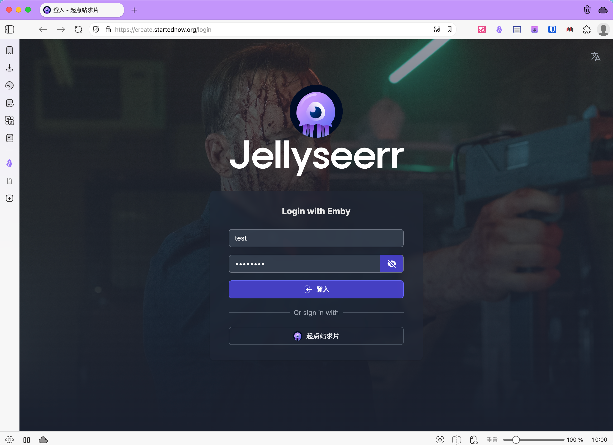
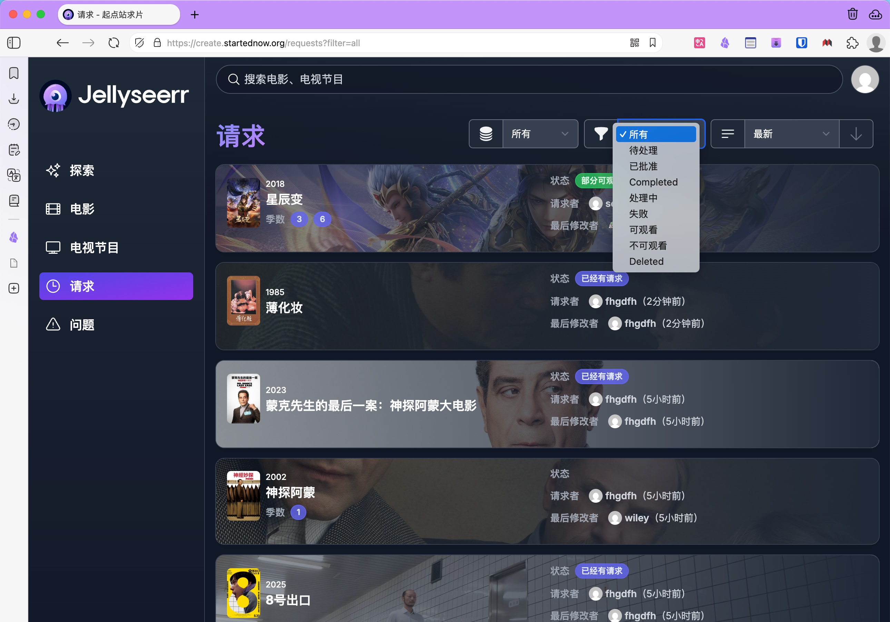
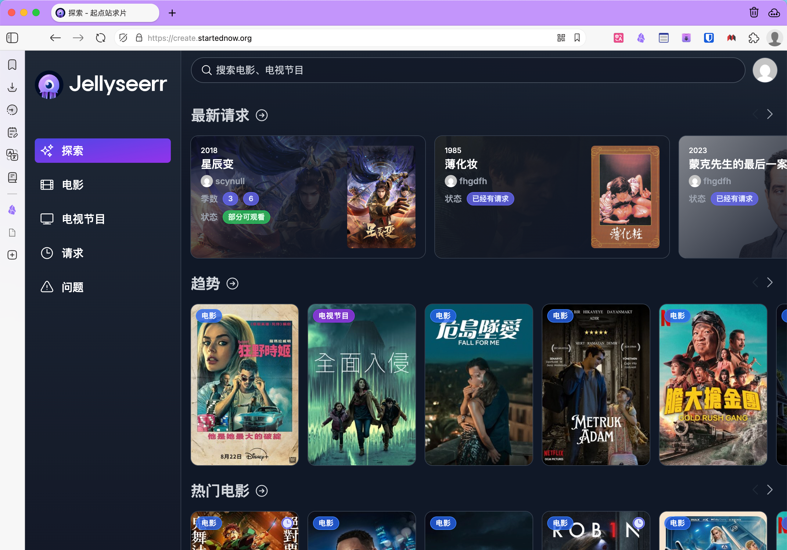
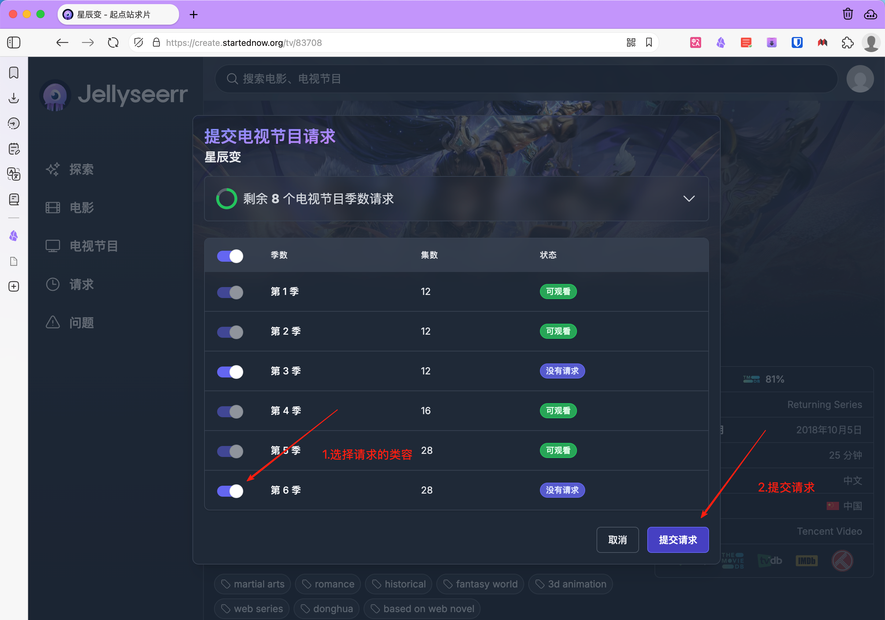

## Ⅰ. 访问与登录

- **访问地址**：在浏览器输入 https://create.startednow.org/login
- **登录方式**： 使用**起点站账号**登录平台
- **移动端支持**： 手机/平板浏览器访问同一地址，界面自适应移动端 建议"添加到主屏幕"实现类APP体验

------

## Ⅱ. 浏览与发现内容

- **首页推荐**： "最新添加"：媒体库中新入库的影视 "热门电影/剧集"：根据平台数据推荐的热门内容 "即将上映"：即将发布的新片/新剧提醒
- **分类探索**： 通过"探索"页按类型（动作、科幻）、评分或年份筛选

------

## Ⅲ. 搜索与提交请求

- **搜索影视**： 在首页搜索栏输入关键词（如电影名、剧集名），系统自动匹配资源
- **提交请求**： 点击目标影视的"提交请求"按钮 **电影**：直接选择画质（如1080p、4K）和存储目录（默认由管理员预设） **剧集**：选择具体季数或单集，支持批量请求整季

------

## Ⅳ. 管理请求状态

- **查看进度**： 点击顶部"请求"标签，查看所有已提交的请求 **状态标识**： ⏳ **待批准**：普通用户需管理员审核 ⬇️ **下载中**：自动推送至下载工具 ✅ **可观看**：已入库媒体库
- **取消请求**： 在请求未开始下载前，点击"取消请求"撤回

------

## Ⅴ. 用户个性化设置

- **语言切换**： 右上角"设置 → 通用设置 → 显示语言 → 简体中文"

------

## Ⅵ. 常见问题解答

- **请求未自动批准**？ 普通用户提交请求需管理员手动批准（防误操作），管理员账号可自动通过
- **找不到影视资源**？ 可能索引器未覆盖，或管理员未配置相关资源站（需联系管理员调整）
- **播放按钮灰色**？ 媒体服务器未正确绑定或资源未刮削，检查Jellyfin/Emby中该资源是否可播放
