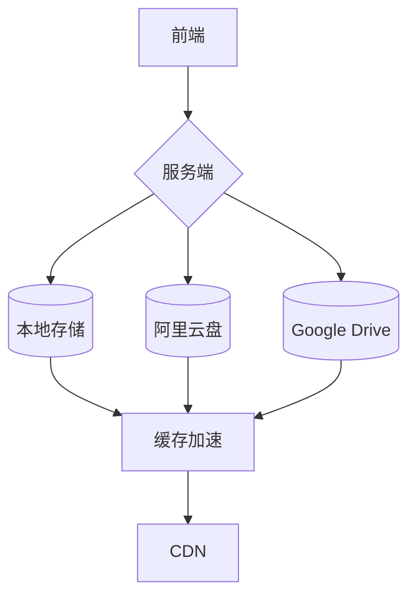

# 私人影视网站搭建计划大纲

## 一、项目概述
1.1 核心目标  
- 搭建支持10-50人访问的私有影视库  
- 实现多终端（PC/手机/TV）4K HDR播放  
- 混合存储方案（本地+网盘+冷备份）  

1.2 用户需求  
- 严格访问控制（邀请制+IP白名单）  
- 支持HEVC直连播放（默认关闭转码）  
- 影片自动刮削（豆瓣/TMDB元数据）  

## 二、架构设计
2.1 技术架构  


2.2 访问流程  
用户终端 --> 安全认证 --> 媒体服务器 --> 智能路由 --> 存储节点 --> 回传播放

## 三、硬件配置方案
3.1 基础配置（10人以下）  
- Intel N100迷你主机（准系统 ¥800）  
- 西数红盘4TB×2（RAID1 ¥1200）  
- 2.5G交换机（TP-Link ¥200）  

3.2 企业级配置（50人）  
- 戴尔R750xs服务器（双Xeon Silver ¥45000）  
- 希捷银河16TB×12（RAID6 ¥36000）  
- 40G光纤网络（MikroTik CRS504 ¥8000）  

## 四、存储方案详解
4.1 国内网盘方案  
| 服务商 | 有效容量 | 访问速度 | 年成本 | 加密方案 |
|--------|---------|---------|-------|---------|
| 115永V | 500TB | 50MB/s | ¥5600 | Rclone Crypt |
| 123云盘 | 100TB | 30MB/s | ¥960 | 文件名混淆 |
| 阿里云盘 | 20TB | 80MB/s | ¥600 | 分卷压缩 |

4.2 跨境存储方案  
- Google Workspace企业版（¥1800/月/无限存储）  
- 子账户管理系统（Pterodactyl面板）  
- 跨境加速（AWS日本节点 ¥2.8/GB）  

## 五、服务端选型对比
5.1 媒体服务器  
- **Jellyfin**：免费开源/Docker部署/需手动优化  
- **Emby**：硬解加速/移动端适配/终身版 ¥480  
- **Plex**：最佳客户端/实时监控/Pass会员 ¥1190/年  

5.2 辅助系统  
- **Alist**：网盘聚合（支持30+云存储）  
- **TMM**：影视元数据刮削（豆瓣API接入）  
- **FileBrowser**：网页端文件管理  

## 六、成本预算
6.1 初期投入  
| 项目 | 家庭版 | 企业版 |
|------|-------|-------|
| 硬件 | ¥2800 | ¥89000 |  
| 软件 | ¥480 | ¥5500 |  
| 存储 | ¥5600 | ¥18000 |  
| 网络 | ¥500 | ¥12000 |  
| 部署 | ¥800 | ¥5000 |  

6.2 年运营成本  
- 电费：¥800（7×24运行）  
- CDN：¥1500（10TB流量包）  
- 网盘：¥6000（115+阿里云盘）  
- 维护：¥3000（系统更新/备份）  

## 七、部署计划
7.1 阶段实施  
```gantt
    title 项目时间表
    section 基础建设
    硬件采购       :2024-08-01, 15d
    网络架设       :2024-08-10, 10d
    section 系统部署
    服务端安装     :2024-08-20, 7d
    存储配置       :2024-08-25, 5d
    section 测试优化
    压力测试       :2024-09-01, 3d
    安全审计       :2024-09-05, 2d
```

## 八、风险控制
8.1 版权规避方案  
- 仅限个人使用（封闭注册）  
- 数字指纹过滤（自动屏蔽院线新片）  
- 存储内容加密（Veracrypt全盘加密）  

8.2 数据安全策略  
- 321备份原则（3份数据/2种介质/1份异地）  
- 自动同步校验（Rclone --checksum）  
- 冷备方案（LTO-8磁带机 ¥15000）  

## 九、维护运营
9.1 日常维护  
- 每周元数据更新（TMM定时任务）  
- 每月存储健康检查（SMART检测）  
- 季度安全更新（系统漏洞修补）  

9.2 用户管理  
- 观影行为分析（Tautulli监控）  
- 流量配额控制（每个用户500GB/月）  
- 设备绑定管理（最多3台设备）  

## 十、附录
10.1 推荐工具清单  
- 播放器：Infuse/Kodi/mpc-be  
- 下载工具：qBittorrent+nastools  
- 监控系统：Zabbix+Prometheus  

10.2 参考文档  
- Emby官方部署指南  
- Alist多网盘配置教程  
- Plex硬件转码优化方案  

> 本大纲基于2024年最新技术方案编制，包含硬件采购指导价（含税）和主流服务商公开报价，实际部署时需根据具体需求调整存储方案和安全策略。建议优先考虑企业级SSD缓存方案（如Intel P4510 8TB）提升热门资源访问速度。